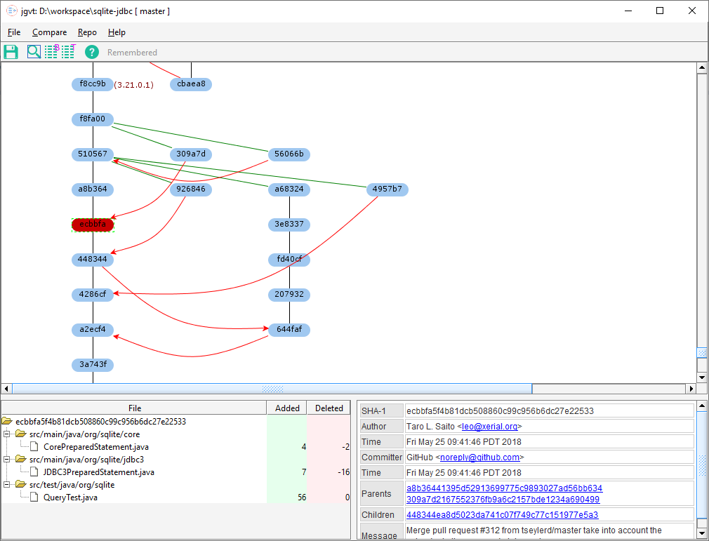

# Java Git Version Tree 

`jgvt` is a [git](https://git-scm.com/) version tree viewer with more
of a ClearCase version tree look-n-feel.  It is written in Java using Swing
to be very portable.

See https://coconut2015.github.io/jgvt/ for documentation.

# Other Similar Tools

* [gitk](https://git-scm.com/docs/gitk)
* [GitVersionTree](https://github.com/crc8/GitVersionTree)
