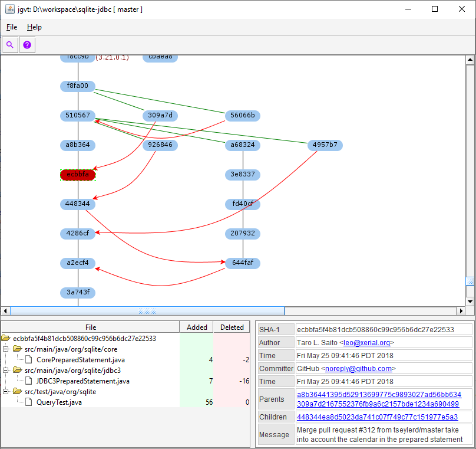

# Java Git Version Tree [](http://www.apache.org/licenses/LICENSE-2.0)

`jgvt` is a [git](https://git-scm.com/) version tree GUI viewer with more
of a ClearCase version tree look-n-feel.



It is written in Java using Swing.

# Build

Use the following command to build.  There are convenience development
code that are disguised as tests.  So it is necessary to skip the
tests when building the package.

```bash
	mvn clean package -Dmaven.test.skip=true
```

# License

`jgvt` is provided under [Apache License 2.0](http://www.apache.org/licenses/LICENSE-2.0).

Additionally, it uses some libraries with permissive licenses.

* [Apache Commons CLI](http://commons.apache.org/proper/commons-cli/) - APL 2.0
* [JGit](https://www.eclipse.org/jgit/) - [Eclipse Distribution License 1.0](https://www.eclipse.org/org/documents/edl-v10.php)
* [JGoodies](http://www.jgoodies.com/freeware/libraries/) - [BSD License](http://www.jgoodies.com/downloads/libraries/)
* [JGraphX](https://github.com/jgraph/jgraphx) - [BSD License](https://github.com/jgraph/jgraphx/blob/master/license.txt)
* [JTreeTable](https://web.archive.org/web/20120626111926/http://java.sun.com/products/jfc/tsc/articles/treetable1/index.html) - BSD License.
* [SLF4J](https://www.slf4j.org/) - [MIT License](https://www.slf4j.org/license.html)

# Other Similar Tools

* [gitk](https://git-scm.com/docs/gitk)
* [GitVersionTree](https://github.com/crc8/GitVersionTree)
