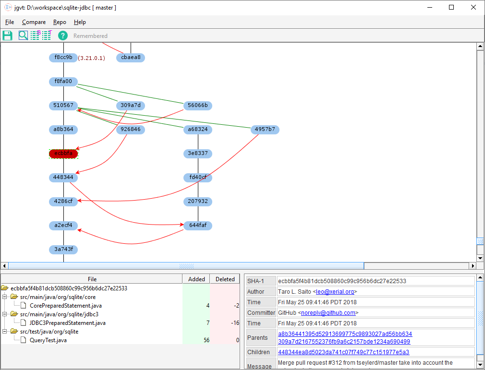

Java Git Version Tree
=====================

**jgvt** is a `git <https://git-scm.com/>`__ version tree viewer with more
of a ClearCase version tree look-n-feel.  It is written in Java using Swing
to be very portable.

It is still under the active development with a lot more features on my to-do
list.  However, it is already very usable at the moment.

